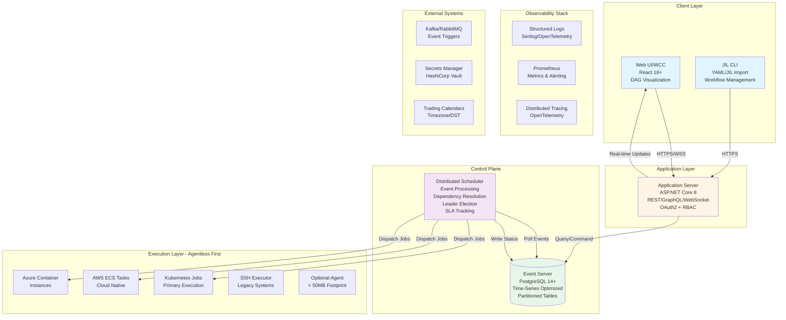

# Sentinel Orchestrator

**Open-source job orchestration platform for capital-markets workflows**  
**Status:** v0.1 Foundation (Architecture & Planning Complete) → v1.0 Atlas (March 2027)  
**License:** Apache 2.0 (Open Source Core) | Commercial (Enterprise Features)

🖥️ **Desktop-First Design:** Like AutoSys WCC, Sentinel provides a powerful cross-platform desktop application (Windows/macOS/Linux) built with Avalonia UI—perfect for operations teams who prefer native apps over web interfaces.

🔄 **AutoSys Migration Ready:** Native JIL parser with 12-26 week migration timeline, automated risk classification, and SOAP/REST integration with legacy systems.

⚡ **Agentless-First Execution:** Execute jobs via Kubernetes, Docker, SSH, or cloud-native services—no heavy agents required (unlike AutoSys/Control-M).

---

## 📋 Project Status

| Component | Status | Target |
|-----------|:------:|--------|
| **Architecture & Design** | ✅ Complete | v0.1 (March 2026) |
| **Domain Models** | ✅ Complete | v0.1 (March 2026) |
| **Desktop Shell (Avalonia)** | ✅ Complete | v0.1 (March 2026) |
| **Core Scheduler** | 🔨 Planned | v0.3 (July 2026) |
| **JIL Migration** | 🔨 Planned | v0.8 (Dec 2026) |
| **Production Release (v1.0)** | 🎯 Planned | March 2027 |

**See [V1_OPEN_SOURCE_SCOPE.md](docs/V1_OPEN_SOURCE_SCOPE.md) for detailed feature roadmap.**

---

```
Sentinel/
├── src/
│   ├── Sentinel.Core/           # Domain models, service interfaces
│   ├── Sentinel.Desktop/        # Avalonia UI desktop app (Windows/macOS/Linux)
│   ├── Sentinel.Infrastructure/ # API clients, auth, external services
│   └── Sentinel.Shared/         # DTOs, constants, extensions
├── tests/                       # Unit & integration tests (xUnit)
├── docs/                        # Architecture, PRD, BRD, technical specs
│   ├── V1_OPEN_SOURCE_SCOPE.md  # ⭐ v1.0 feature scope & roadmap
│   ├── ARCHITECTURE.md          # System architecture & patterns
│   ├── TECHNICAL_SPEC.md        # Detailed technical specifications
│   ├── SYSTEM_DESIGN.md         # Component design & data models
│   └── ACCELERATED_MIGRATION.md # 12-week AutoSys migration strategy
├── .github/
│   ├── agents/                  # Copilot agents (staff-engineer, qa-engineer, etc.)
│   └── skills/                  # Domain skills (scheduler, database, etc.)
└── Sentinel.sln                 # Solution f

```bash
# Clone the repository
git clone https://github.com/yourusername/sentinel.git
cd sentinel

# Restore dependencies
dotnet restore

# Run the desktop application
dotnet run --project src/Sentinel.Desktop
```

## 🎯 Why Sentinel vs AutoSys/Control-M

| Feature | AutoSys/Control-M | Sentinel |
|---------|-------------------|----------|
| **Interface** | Java Desktop App (WCC) | .NET Desktop App (Avalonia) + Optional Web UI |
| **Architecture** | Monolithic, legacy | Cloud-native, microservices |
| **Execution** | Heavy agents (100MB+ per host) | **Agentless-first** (K8s, SSH, PowerShell) |
| **APIs** | Limited SOAP/REST | Modern REST + GraphQL + WebSockets **+ SOAP for legacy** |
| **Migration** | Manual rewrite | **JIL parser with 6-month timeline** |
| **Cost** | $150K+/year licensing | Open-source core ($0) |
| **24/7 Trading** | Limited calendar support | Native trading session calendars |

## 🏗️ Architecture

Sentinel uses a modern six-component architecture with agentless-first execution:



## 🔄 AutoSys Migration (12-26 weeks)

Sentinel offers **two migration strategies** from AutoSys/Control-M:

### 🚀 Accelerated Migration (12 weeks)
**Recommended for:** Organizations with strong DevOps teams and appetite for automation

- **Phase 1 (1 week)**: AI-powered job classification and automated environment setup
- **Phase 2 (2 weeks)**: Parallel pilot with auto-validation for low-risk jobs
- **Phase 3 (4 weeks)**: Batch migration with selective validation (70% auto-approved)
- **Phase 4 (5 weeks)**: Final wave with progressive AutoSys decommissioning

**Key Features:**
- ✅ **AI Risk Classifier**: Automatically categorizes jobs as low/medium/high risk
- ✅ **Parallel Processing**: Migrate 20+ jobs simultaneously
- ✅ **Auto-Validation**: Skip side-by-side for 70% of jobs (low-risk)
- ✅ **Batch Deployment**: Deploy 50-100 jobs at once
- ✅ **54% Faster**, 36% cheaper ($162K vs $255K)

**Risk:** Medium (1-2% rollback rate, instant rollback capability)

See [ACCELERATED_MIGRATION.md](docs/ACCELERATED_MIGRATION.md) for details.

---

### 🔒 Standard Migration (26 weeks)
**Recommended for:** Highly regulated environments, risk-averse organizations

- **Phase 1 (2 weeks)**: Manual preparation and analysis
- **Phase 2 (4 weeks)**: Pilot with 10-20 jobs, extensive side-by-side validation
- **Phase 3 (8 weeks)**: Wave 1 migration (100-200 jobs) with full validation
- **Phase 4 (12 weeks)**: Wave 2 complete migration and decommissioning

**Key Features:**
- ✅ **Full Side-by-Side Validation**: Every job runs in parallel for 7+ days
- ✅ **Manual Review**: Human approval for every migration
- ✅ **Zero-Risk Approach**: Extensive testing and burn-in periods
- ✅ **Audit-Ready**: Complete documentation for compliance

**Risk:** Very Low (<0.1% rollback rate)

See [SYSTEM_DESIGN.md](docs/SYSTEM_DESIGN.md#91-autosys-to-sentinel-migration-plan) for details.

---

### Migration Comparison

| Factor | Accelerated (12 weeks) | Standard (26 weeks) |
|--------|------------------------|---------------------|
| **Duration** | 12 weeks (3 months) | 26 weeks (6 months) |
| **Cost** | $162K | $255K |
| **Automation** | 70% jobs auto-validated | 20% automation |
| **Rollback Rate** | 1-2% (instant recovery) | <0.1% |
| **Parallel Jobs** | 20+ simultaneous | 5-10 simultaneous |
| **Best For** | Agile teams, tight deadlines | Regulated industries |
| **Engineering** | 4 FTEs | 3 FTEs |

### Legacy System Integration

| Protocol | Support | Use Case |
|----------|---------|----------|
| **REST** | ✅ Native | Modern APIs |
| **GraphQL** | ✅ Native | Complex queries |
| **WebSockets** | ✅ Native | Real-time updates |
| **SOAP** | 🔄 Adapter | Legacy mainframe/AutoSys integration |
| **JIL Format** | ✅ Parser | AutoSys job import |

*SOAP adapter allows Sentinel to integrate with existing SOAP-based enterprise systems during migration.*

## 🖥️ Desktop App Features

The Sentinel Desktop App (like AutoSys WCC) provides:

- **Dashboard**: Real-time workflow status, SLA tracking, active alerts with auto-refresh
- **Workflow Designer**: Visual DAG editor with drag-and-drop task creation (coming in M1.10)
- **Run Monitor**: Live execution tracking with log streaming via SignalR
- **🆕 Enhanced Migration Wizard**: 
  - **AI Risk Classifier**: Auto-categorize jobs as low/medium/high risk
  - **Parallel Import**: Process 20+ JIL jobs simultaneously  
  - **Auto-Validation**: Skip side-by-side for 70% of low-risk jobs
  - **Real-Time Progress**: Live dashboard showing migration status
  - **Side-by-Side Comparison**: Automated output diff with AI analysis
- **Calendar Manager**: Trading calendars, holidays, maintenance windows
- **Alert Center**: SLA breaches, failures, anomalies with AI suggestions
- **Audit Viewer**: Immutable audit trail for compliance

**Enhanced Desktop Features (v0.1):**
- ✅ Real-time updates via SignalR (no polling, instant notifications)
- ✅ Dependency injection with proper service layer integration
- ✅ Async/await throughout for responsive UI (never blocks)
- ✅ Auto-refresh dashboard every 30 seconds (configurable)
- ✅ Multi-step migration wizard with AI-powered risk analysis

**Performance**: < 2s startup, 60 FPS rendering, < 150MB RAM

**Platform**: Windows 10/11, macOS 11+, Linux (Ubuntu 20.04+)
    SCHED -->|Dispatch Jobs| SSH
    SCHED -->|Dispatch Jobs| AGENT
    
    K8S -->|Stream Logs| DB
    ECS -->|Stream Logs| DB
    ACI -->|Stream Logs| DB
    SSH -->|Stream Logs| DB
    AGENT -->|Stream Logs| DB
    
    SCHED -.->|Consume Events| KAFKA
    SCHED -.->|Check Calendars| CAL
    K8S -.->|Fetch Secrets| VAULT
    ECS -.->|Fetch Secrets| VAULT
    
    API -->|Emit Logs| LOGS
    SCHED -->|Emit Logs| LOGS
    K8S -->|Emit Logs| LOGS
    
    API -->|Emit Metrics| METRICS
    SCHED -->|Emit Metrics| METRICS
    
    API -->|Traces| TRACE
    SCHED -->|Traces| TRACE

    style DB fill:#4A90E2,stroke:#2E5C8A,stroke-width:3px,color:#fff
    style SCHED fill:#E67E22,stroke:#BA6A1A,stroke-width:3px,color:#fff
    style API fill:#27AE60,stroke:#1E8449,stroke-width:3px,color:#fff
    style K8S fill:#9B59B6,stroke:#7D3C98,stroke-width:2px,color:#fff
    style ECS fill:#9B59B6,stroke:#7D3C98,stroke-width:2px,color:#fff
    style ACI fill:#9B59B6,stroke:#7D3C98,stroke-width:2px,color:#fff
    style UI fill:#3498DB,stroke:#2874A6,stroke-width:2px,color:#fff
    style CLI fill:#3498DB,stroke:#2874A6,stroke-width:2px,color:#fff
```

### Core Components

1. **Event Server** - PostgreSQL-based central database with time-series optimization for job history
2. **Scheduler** - Distributed orchestration engine with leader election and dependency resolution
3. **Application Server** - REST/GraphQL/WebSocket APIs with OAuth2 authentication and RBAC
4. **Execution Runtime** - Agentless-first (Kubernetes Jobs, AWS ECS, Azure Container Instances, SSH)
5. **Web UI/WCC** - React-based workflow control center with DAG visualization
6. **JIL CLI** - Command-line interface with JIL/YAML import and workflow management


## 🎯 Design Principles

Have an extremely simple setup process with a minimal learning curve.
Manage job scheduling and orchestration quickly and in parallel.
Avoid custom-agents and additional open ports, be agentless by leveraging the existing SSH daemon and native technologies.
Describe jobs in a language that is both machine and human friendly.
Focus on security and easy auditability/review/rewriting of content.
Be the easiest job scheduling and orchestration automation system to use, ever. Financial institutions should be able to onboard hundreds of workflows in days, not months, and maintain them with ease.


## 🎯 Features

- **Agentless-First Execution**: 60-80% of jobs run without agents using cloud-native runtimes
- **DAG-based Workflows**: Visual workflow designer with dependency management
- **24/7 Trading Support**: Session-aware calendars for follow-the-sun operations
- **JIL Migration**: Import AutoSys jobs with ≥70% automated conversion and confidence scoring
- **YAML DSL**: Modern workflow definitions with templates and validation
- **Real-time Observability**: Live monitoring with SLA tracking and anomaly detection
- **Compliance Ready**: Immutable audit trails, evidence packs, and digital signatures

## 🛠 Technology Stack

| Component | Technology |
|-----------|------------|
| UI Framework | Avalonia UI 11 |
| Runtime | .NET 8 LTS |
| Architecture | MVVM (CommunityToolkit) |
| API Client | Refit 8.0 |
| Logging | Serilog |

## 📦 Building for Production

### Windows
```bash
dotnet publish src/Sentinel.Desktop -c Release -r win-x64 --self-contained
```

### macOS
```bash
dotnet publish src/Sentinel.Desktop -c Release -r osx-arm64 --self-contained
```

### Linux
```bash
dotnet publish src/Sentinel.Desktop -c Release -r linux-x64 --self-contained
```

## � Documentation

| Document | Description |
|----------|-------------|
| [V1 Open Source Scope](docs/V1_OPEN_SOURCE_SCOPE.md) | ⭐ Feature roadmap and v1.0 scope definition |
| [Architecture](docs/ARCHITECTURE.md) | System architecture and design patterns |
| [Technical Spec](docs/TECHNICAL_SPEC.md) | Detailed technical specifications |
| [System Design](docs/SYSTEM_DESIGN.md) | Component design and data models |
| [Accelerated Migration](docs/ACCELERATED_MIGRATION.md) | 12-week AutoSys migration strategy |
| [Product Requirements](docs/prd.md) | Product requirements document |
| [Business Requirements](docs/brd.md) | Business requirements document |
| [Future State](docs/FUTURE_STATE.md) | Long-term roadmap and feature planning |

---

## 🤝 Contributing

We welcome contributions! Sentinel is in early development (v0.1), focusing on architecture and core infrastructure.

**Current Focus Areas:**
- Core scheduler implementation (cron parsing, dependency resolution)
- JIL parser and AutoSys migration tooling
- PostgreSQL schema and Entity Framework migrations
- REST API endpoints
- Desktop UI enhancements

**How to Contribute:**
1. Fork the repository
2. Create a feature branch (`git checkout -b feature/amazing-feature`)
3. Commit your changes (`git commit -m 'Add amazing feature'`)
4. Push to the branch (`git push origin feature/amazing-feature`)
5. Open a Pull Request

**Development Setup:**
- .NET 8.0 SDK
- Visual Studio 2022, VS Code, or JetBrains Rider
- PostgreSQL 16+ (for integration tests)
- Docker (for containerized testing)

See [CONTRIBUTING.md](CONTRIBUTING.md) for detailed guidelines (coming soon).

---

## 📜 License

**Open Source Core:** Apache 2.0  
**Enterprise Features:** Commercial License

Sentinel Orchestrator is dual-licensed:
- The **core platform** (scheduler, API, CLI, basic UI, JIL parser) is licensed under [Apache License 2.0](LICENSE)
- **Enterprise features** (AI risk classifier, SAML/OIDC SSO, SOX compliance automation, priority support) require a commercial license

Copyright © 2026 Sentinel Orchestrator Contributors

---

## 🙏 Acknowledgments

- Built with [Avalonia UI](https://avaloniaui.net/) for cross-platform desktop
- Inspired by AutoSys, Apache Airflow, and modern orchestration platforms
- Supported by the open-source community and early adopters in financial services

---

## 📧 Contact

- **Issues & Bugs:** [GitHub Issues](https://github.com/machugram/sentinel/issues)
- **Discussions:** [GitHub Discussions](https://github.com/machugram/sentinel/discussions)

---

**⭐ Star this project if you're interested in a modern AutoSys alternative!**
