# Sentinel Orchestrator

**Open-source job orchestration platform for capital-markets workflows**  
**Status:** v0.1 desktop operations console (mock catalog) → v1.0 Atlas (March 2027)  
**License:** Apache 2.0 (Open Source Core) | Commercial (Enterprise Features)

🖥️ **Desktop-First Design:** Like AutoSys WCC, Sentinel is a cross-platform desktop app (Windows/macOS/Linux) built with Avalonia UI—native, not a browser tab.

🔄 **AutoSys Migration Ready:** A JIL wizard that parses jobs, classifies risk, converts commands, and imports draft workflows.

⚡ **Agentless-First Execution (roadmap):** Kubernetes, Docker, SSH, or cloud-native services—no heavy agents required.

This README shows the **running v0.1 console**: screenshots from the live mock catalog, plus flow and sequence diagrams of the operator loop.

---

## Project status

| Component | Status | Target |
|-----------|:------:|--------|
| Architecture & Design | Complete | v0.1 |
| Domain Models | Complete | v0.1 |
| Desktop shell (Avalonia) | Complete | v0.1 |
| Operator loop (mock runs, JIL, calendars) | Complete | v0.1 |
| Core Scheduler | Planned | v0.3 (July 2026) |
| Production JIL / AutoSys cutover | Planned | v0.8 (Dec 2026) |
| Production release (v1.0) | Planned | March 2027 |

v0.1 is a **desktop UX + local mock services**. It does not yet run a scheduler, API, or Postgres. Mock data lives under `%LocalAppData%/Sentinel/` (or the equivalent on macOS/Linux).

---

## Repository layout

```
Sentinel/
├── src/
│   ├── Sentinel.Core/           # Domain models, service interfaces
│   ├── Sentinel.Desktop/        # Avalonia UI (Windows / macOS / Linux)
│   ├── Sentinel.Infrastructure/ # Mock catalog, API clients, persistence
│   └── Sentinel.Shared/         # DTOs, constants, extensions
├── tests/                       # xUnit tests
├── assets/readme/               # Screenshots used in this README
└── Sentinel.sln
```

---

## Quick start

```bash
git clone https://github.com/machugram/sentinel.git
cd sentinel
dotnet restore
dotnet run --project src/Sentinel.Desktop
```

Shortcuts: `Ctrl+K` command palette, `Ctrl+N` new workflow, `F5` refresh, `Esc` closes confirm then palette.

---

## Screenshots

All captures are from the native Avalonia app against the **local mock** catalog.

### Operations dashboard

KPI cards jump to Workflows, Running jobs, Runs, or Alerts. Recent runs and the alert list are clickable.

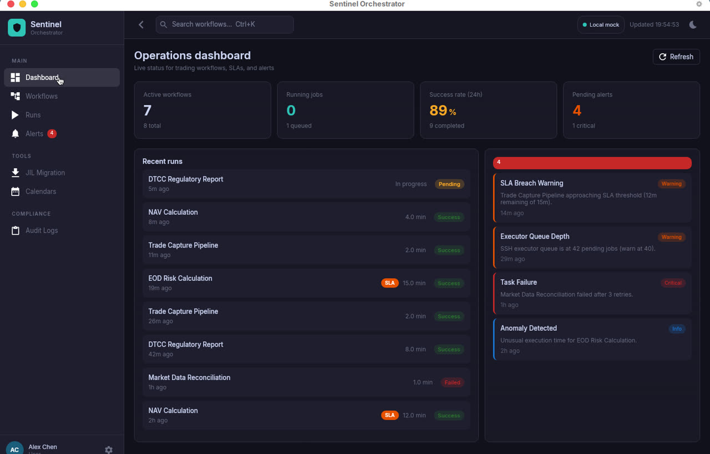

### Workflows

Schedule in plain language, per-row **Run now**, **View runs**, **Edit**, and a ⋯ menu for Duplicate / Pause / Archive / Delete.

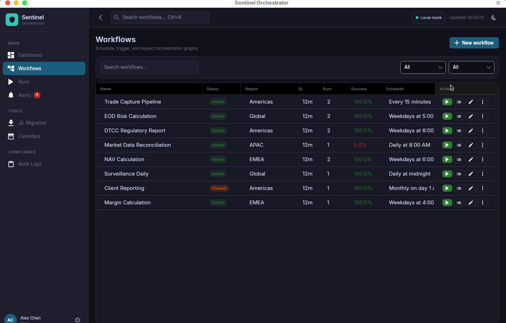

### Run now confirmation

Destructive and triggering actions go through a confirm overlay before they touch the catalog.

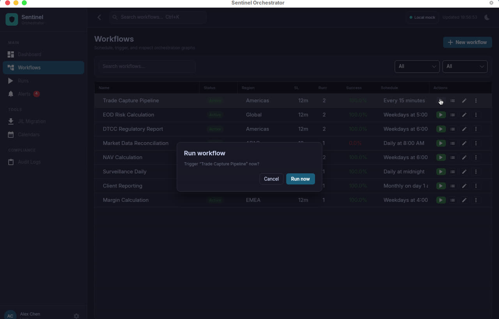

Delete uses the same overlay with a danger button.

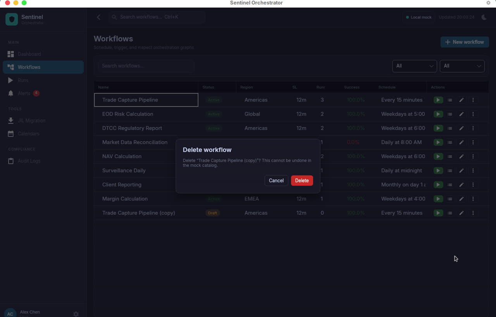

### Live run

After confirm, Sentinel opens the new run. Tasks advance sequentially; pending tasks log *waiting on previous task*.

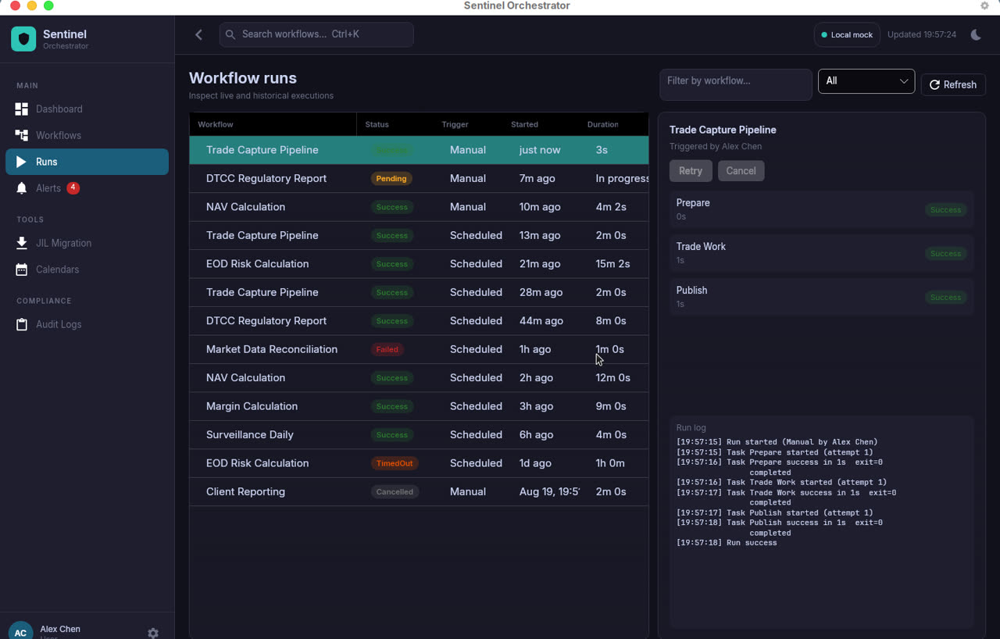

### Alert center

KPI and dashboard alerts land here with severity, suggested action, Acknowledge / Open run / Resolve.

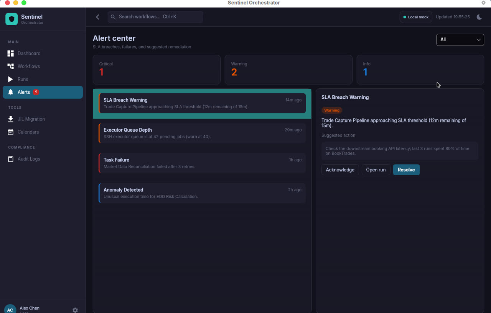

### JIL migration

Parse sample AutoSys JIL → classify risk → convert. The convert grid keeps the **real command** (script path, watcher file, and so on), not a reconstructed stub.

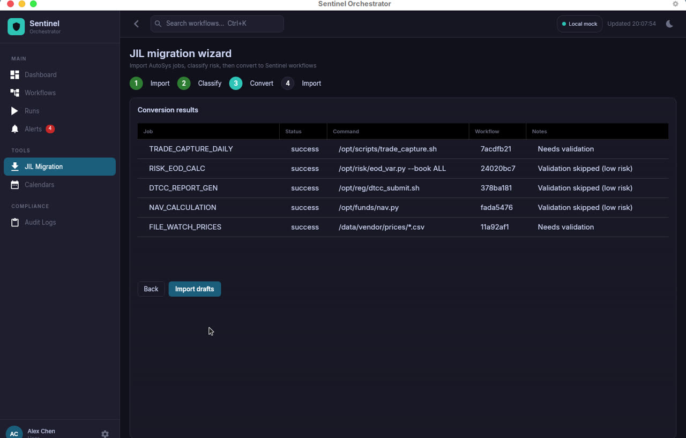

Import writes **draft workflows**. Open drafts filters the Workflows grid to `Draft`.

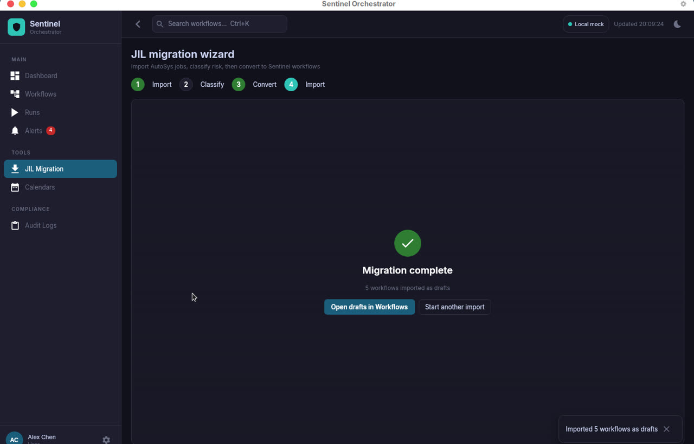

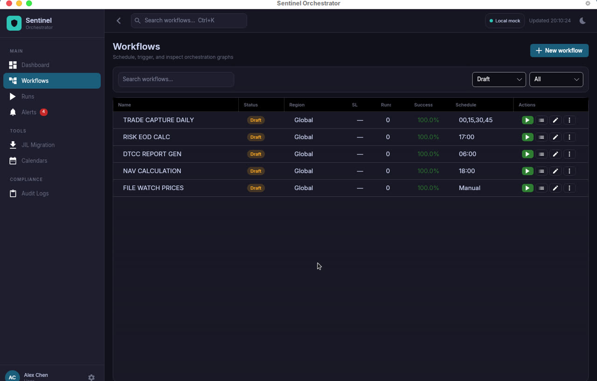

### Trading calendars

Add/remove sessions, holidays, and maintenance windows, then **Save calendar**. The mock catalog persists the object.

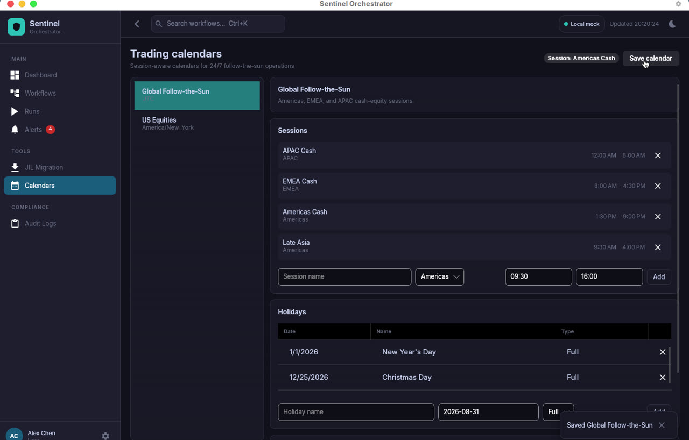

### Settings

Connection, theme, and refresh interval save on this machine. **Reset demo data** asks before replacing the catalog with the seed.

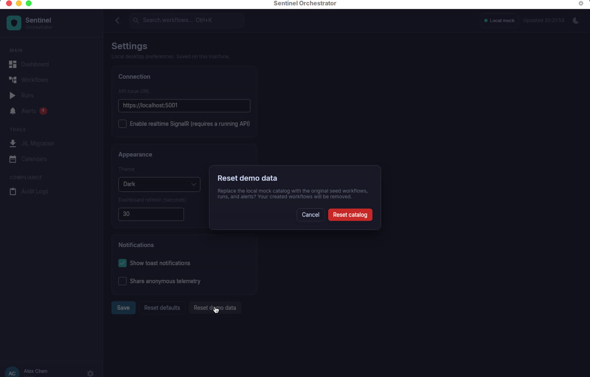

---

## Operator flows

How an operator moves through the v0.1 console.

### Screen map

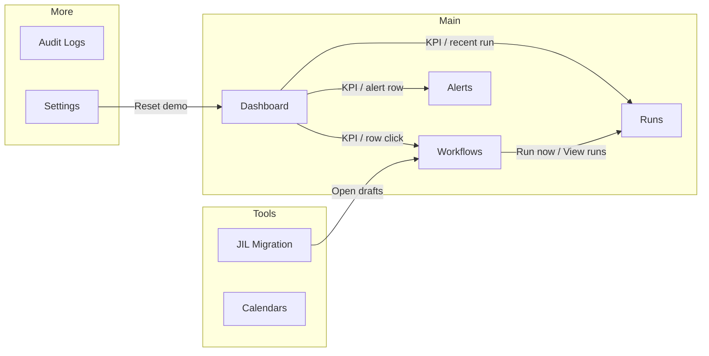
```mermaid
flowchart LR
  subgraph Main
    D[Dashboard]
    W[Workflows]
    R[Runs]
    A[Alerts]
  end
  subgraph Tools
    J[JIL Migration]
    C[Calendars]
  end
  subgraph More
    U[Audit Logs]
    S[Settings]
  end
  D -->|KPI / row click| W
  D -->|KPI / recent run| R
  D -->|KPI / alert row| A
  W -->|Run now / View runs| R
  J -->|Open drafts| W
  S -->|Reset demo| D
```

### Day-to-day operator loop

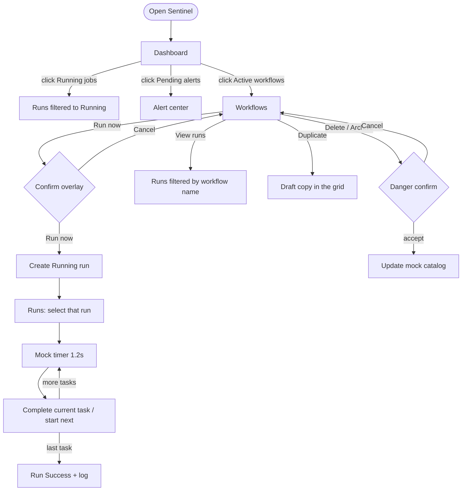
```mermaid
flowchart TD
  Start([Open Sentinel]) --> Dash[Dashboard]
  Dash -->|click Running jobs| RunsFilter[Runs filtered to Running]
  Dash -->|click Pending alerts| Alerts[Alert center]
  Dash -->|click Active workflows| Wf[Workflows]

  Wf -->|Run now| ConfirmRun{Confirm overlay}
  ConfirmRun -->|Cancel| Wf
  ConfirmRun -->|Run now| Trigger[Create Running run]
  Trigger --> RunsDetail[Runs: select that run]
  RunsDetail --> Tick[Mock timer 1.2s]
  Tick --> NextTask[Complete current task / start next]
  NextTask -->|more tasks| Tick
  NextTask -->|last task| Success[Run Success + log]

  Wf -->|View runs| RunsNamed[Runs filtered by workflow name]
  Wf -->|Duplicate| Copy[Draft copy in the grid]
  Wf -->|Delete / Archive| ConfirmDanger{Danger confirm}
  ConfirmDanger -->|Cancel| Wf
  ConfirmDanger -->|accept| Persist[Update mock catalog]
```

### JIL import path

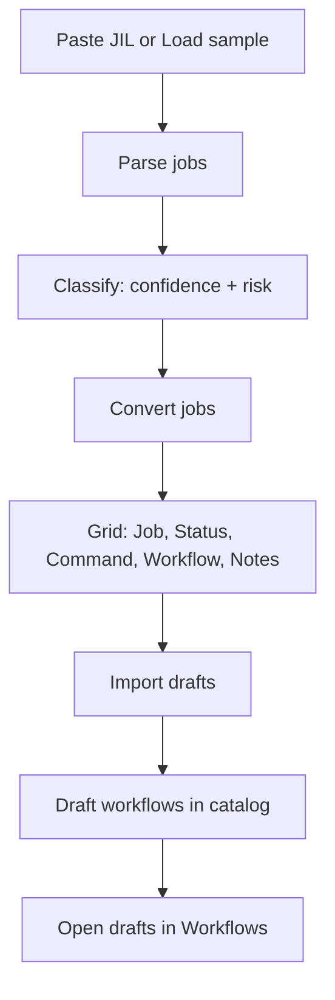
```mermaid
flowchart TD
  A[Paste JIL or Load sample] --> B[Parse jobs]
  B --> C[Classify: confidence + risk]
  C --> D[Convert jobs]
  D --> E[Grid: Job, Status, Command, Workflow, Notes]
  E --> F[Import drafts]
  F --> G[Draft workflows in catalog]
  G --> H[Open drafts in Workflows]
```

---

## Sequence diagrams

These match the v0.1 wiring: Avalonia view-models, `IWorkflowService` / `IJilMigrationService`, `MockDataStore`, and a 1.2s timer.

### Run now → live task progress

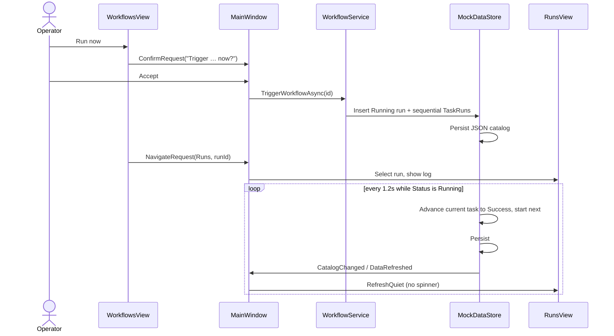
```mermaid
sequenceDiagram
  actor Op as Operator
  participant Wf as WorkflowsView
  participant Win as MainWindow
  participant Svc as WorkflowService
  participant Store as MockDataStore
  participant Runs as RunsView

  Op->>Wf: Run now
  Wf->>Win: ConfirmRequest("Trigger … now?")
  Op->>Win: Accept
  Win->>Svc: TriggerWorkflowAsync(id)
  Svc->>Store: Insert Running run + sequential TaskRuns
  Store->>Store: Persist JSON catalog
  Wf->>Win: NavigateRequest(Runs, runId)
  Win->>Runs: Select run, show log

  loop every 1.2s while Status is Running
    Store->>Store: Advance current task to Success, start next
    Store->>Store: Persist
    Store->>Win: CatalogChanged / DataRefreshed
    Win->>Runs: RefreshQuiet (no spinner)
  end
```

### JIL convert and import

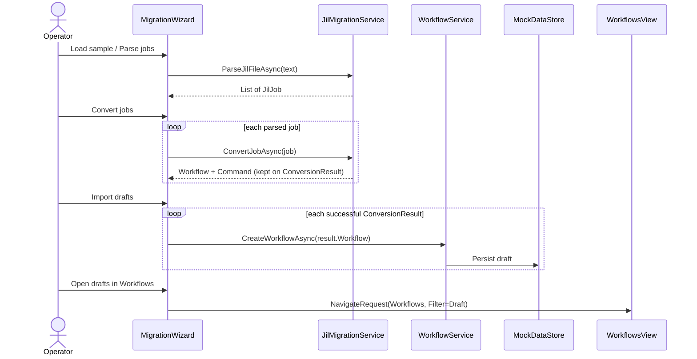
```mermaid
sequenceDiagram
  actor Op as Operator
  participant Wiz as MigrationWizard
  participant Jil as JilMigrationService
  participant Svc as WorkflowService
  participant Store as MockDataStore
  participant Wf as WorkflowsView

  Op->>Wiz: Load sample / Parse jobs
  Wiz->>Jil: ParseJilFileAsync(text)
  Jil-->>Wiz: List of JilJob
  Op->>Wiz: Convert jobs
  loop each parsed job
    Wiz->>Jil: ConvertJobAsync(job)
    Jil-->>Wiz: Workflow + Command (kept on ConversionResult)
  end
  Op->>Wiz: Import drafts
  loop each successful ConversionResult
    Wiz->>Svc: CreateWorkflowAsync(result.Workflow)
    Svc->>Store: Persist draft
  end
  Op->>Wiz: Open drafts in Workflows
  Wiz->>Wf: NavigateRequest(Workflows, Filter=Draft)
```

### Calendar save

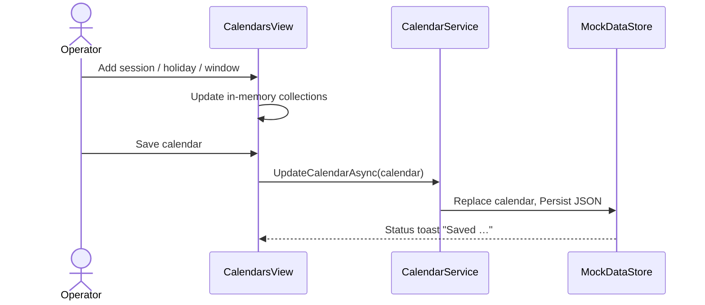
```mermaid
sequenceDiagram
  actor Op as Operator
  participant Cal as CalendarsView
  participant Svc as CalendarService
  participant Store as MockDataStore

  Op->>Cal: Add session / holiday / window
  Cal->>Cal: Update in-memory collections
  Op->>Cal: Save calendar
  Cal->>Svc: UpdateCalendarAsync(calendar)
  Svc->>Store: Replace calendar, Persist JSON
  Store-->>Cal: Status toast "Saved …"
```

### Confirm overlay (any danger / trigger action)

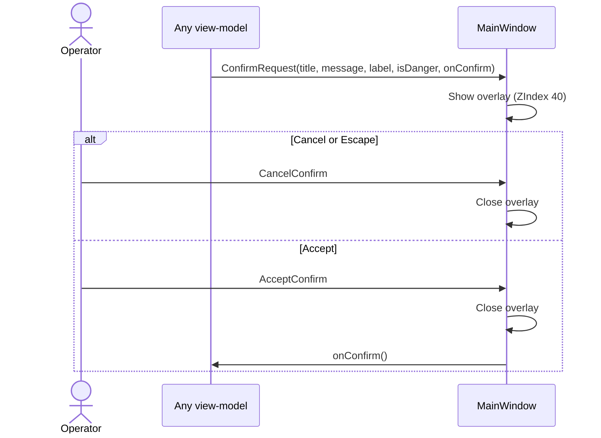
```mermaid
sequenceDiagram
  actor Op as Operator
  participant View as Any view-model
  participant Win as MainWindow

  View->>Win: ConfirmRequest(title, message, label, isDanger, onConfirm)
  Win->>Win: Show overlay (ZIndex 40)
  alt Cancel or Escape
    Op->>Win: CancelConfirm
    Win->>Win: Close overlay
  else Accept
    Op->>Win: AcceptConfirm
    Win->>Win: Close overlay
    Win->>View: onConfirm()
  end
```

---

## Why Sentinel vs AutoSys / Control-M

| Feature | AutoSys / Control-M | Sentinel |
|---------|---------------------|----------|
| Interface | Java desktop (WCC) | .NET desktop (Avalonia) + optional web UI later |
| Architecture | Monolithic, legacy | Cloud-native target; v0.1 is desktop + mock |
| Execution | Heavy agents | **Agentless-first** (K8s, SSH, PowerShell) on the roadmap |
| APIs | Limited SOAP/REST | REST + GraphQL + WebSockets **+ SOAP for legacy** (planned) |
| Migration | Manual rewrite | **JIL wizard** with risk classification |
| Cost | $150K+/year licensing | Open-source core |
| 24/7 trading | Limited calendars | Session-aware trading calendars |

---

## Architecture

### What v0.1 actually runs

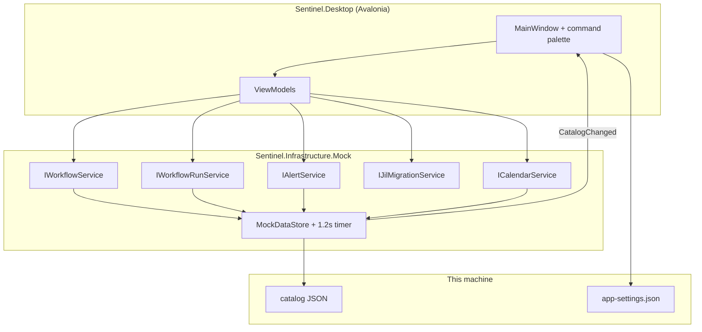
```mermaid
flowchart TB
  subgraph Desktop["Sentinel.Desktop (Avalonia)"]
    Shell[MainWindow + command palette]
    VMs[ViewModels]
    Shell --> VMs
  end

  subgraph Infra["Sentinel.Infrastructure.Mock"]
    WF[IWorkflowService]
    Run[IWorkflowRunService]
    Alert[IAlertService]
    Jil[IJilMigrationService]
    Cal[ICalendarService]
    Store[MockDataStore + 1.2s timer]
    WF --> Store
    Run --> Store
    Alert --> Store
    Cal --> Store
  end

  subgraph Disk["This machine"]
    JSON[catalog JSON]
    Cfg[app-settings.json]
  end

  VMs --> WF
  VMs --> Run
  VMs --> Alert
  VMs --> Jil
  VMs --> Cal
  Store --> JSON
  Shell --> Cfg
  Store -->|CatalogChanged| Shell
```

### Target platform (v1.0)

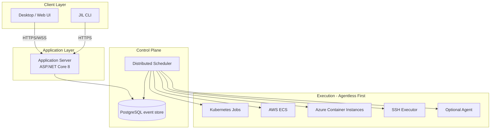
```mermaid
graph TB
    subgraph "Client Layer"
        UI[Desktop / Web UI]
        CLI[JIL CLI]
    end

    subgraph "Application Layer"
        API[Application Server<br/>ASP.NET Core 8]
    end

    subgraph "Control Plane"
        SCHED[Distributed Scheduler]
        DB[(PostgreSQL event store)]
    end

    subgraph "Execution - Agentless First"
        K8S[Kubernetes Jobs]
        ECS[AWS ECS]
        ACI[Azure Container Instances]
        SSH[SSH Executor]
        AGENT[Optional Agent]
    end

    UI -->|HTTPS/WSS| API
    CLI -->|HTTPS| API
    API --> DB
    SCHED --> DB
    SCHED --> K8S
    SCHED --> ECS
    SCHED --> ACI
    SCHED --> SSH
    SCHED --> AGENT
```

### Core components (target)

1. **Event Server** — PostgreSQL job history
2. **Scheduler** — orchestration, dependencies, SLAs
3. **Application Server** — REST / GraphQL / WebSocket, OAuth2, RBAC
4. **Execution runtime** — Kubernetes, ECS, ACI, SSH
5. **Desktop / Web UI** — operations console and DAG designer
6. **JIL CLI** — import and workflow management

---

## AutoSys migration (12–26 weeks)

Two strategies; the desktop wizard in v0.1 is the **operator-facing** piece of that path.

### Accelerated (12 weeks)

For teams that can automate validation.

- Phase 1 (1 week): classify jobs, stand up the environment
- Phase 2 (2 weeks): parallel pilot, auto-validate low-risk jobs
- Phase 3 (4 weeks): batch migration
- Phase 4 (5 weeks): decommission AutoSys

### Standard (26 weeks)

For highly regulated shops: side-by-side runs, manual review, audit pack.

| Factor | Accelerated | Standard |
|--------|-------------|----------|
| Duration | 12 weeks | 26 weeks |
| Automation | ~70% auto-validated | ~20% |
| Best for | Agile teams, tight deadlines | Regulated industries |

### Legacy protocols (planned)

| Protocol | Role |
|----------|------|
| REST / GraphQL / WebSockets | Native APIs |
| SOAP | Adapter for mainframe / AutoSys |
| JIL | Parser + desktop wizard (v0.1 mock) |

---

## Desktop app (v0.1)

- **Dashboard** — KPIs, recent runs, alerts, click-through navigation
- **Workflows** — create/edit with human schedules, parameters, task list, SLA; lifecycle menu
- **Runs** — live and historical executions, sequential task log, Retry / Cancel
- **JIL wizard** — parse, classify, convert (honest Command column), import drafts
- **Calendars** — sessions, holidays, maintenance windows, save to catalog
- **Alerts / Audit / Settings** — acknowledge, export, persist prefs, reset demo data
- Command palette (`Ctrl+K`), confirm overlays, toasts, dark/light theme

**Platform:** Windows 10/11, macOS 11+, Linux (Ubuntu 20.04+)

---

## Design principles

Have an extremely simple setup process with a minimal learning curve.  
Manage job scheduling and orchestration quickly and in parallel.  
Avoid custom agents and extra open ports; be agentless where SSH and native runtimes already exist.  
Describe jobs in a language that is both machine and human friendly.  
Focus on security and easy auditability.  
Be the easiest job scheduling system to use. Firms should onboard hundreds of workflows in days, not months.

---

## Technology stack

| Component | Technology |
|-----------|------------|
| UI | Avalonia UI 11 |
| Runtime | .NET 8 LTS |
| Architecture | MVVM (CommunityToolkit) |
| API client | Refit 8.0 |
| Logging | Serilog |
| v0.1 catalog | JSON files + in-process timer |

---

## Building for production

```bash
# Windows
dotnet publish src/Sentinel.Desktop -c Release -r win-x64 --self-contained

# macOS
dotnet publish src/Sentinel.Desktop -c Release -r osx-arm64 --self-contained

# Linux
dotnet publish src/Sentinel.Desktop -c Release -r linux-x64 --self-contained
```

---

## Contributing

v0.1 is the desktop console and mock catalog. Useful next work: scheduler, JIL parser hardening, Postgres schema, REST API, DAG designer.

1. Fork the repository
2. Create a feature branch
3. Open a pull request

**Dev setup:** .NET 8 SDK; Visual Studio 2022, VS Code, or Rider.

---

## License

**Open Source Core:** Apache 2.0  
**Enterprise Features:** Commercial License

Copyright © 2026 Sentinel Orchestrator Contributors

---

## Acknowledgments

- [Avalonia UI](https://avaloniaui.net/) for the desktop shell
- AutoSys, Apache Airflow, and modern orchestration platforms

---

## Contact

- **Issues:** [GitHub Issues](https://github.com/machugram/sentinel/issues)
- **Discussions:** [GitHub Discussions](https://github.com/machugram/sentinel/discussions)
